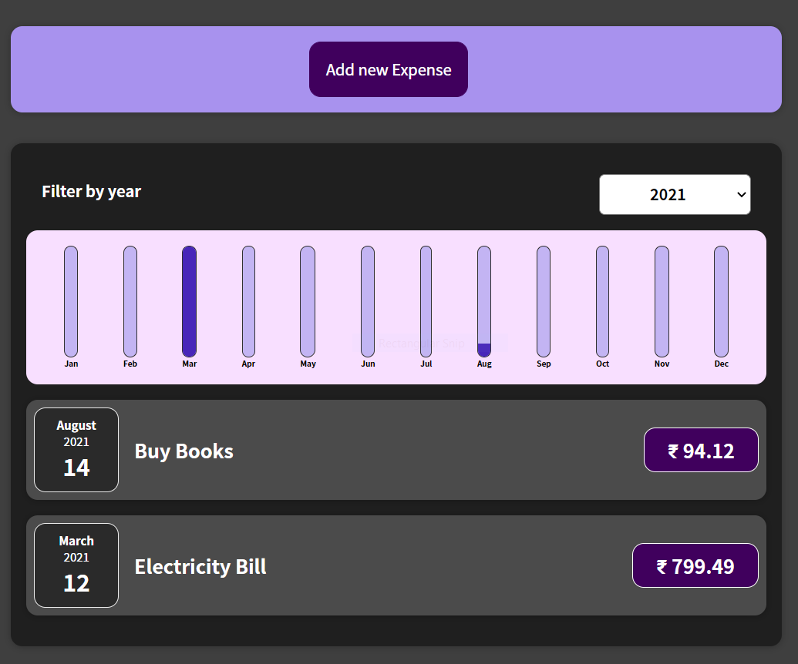
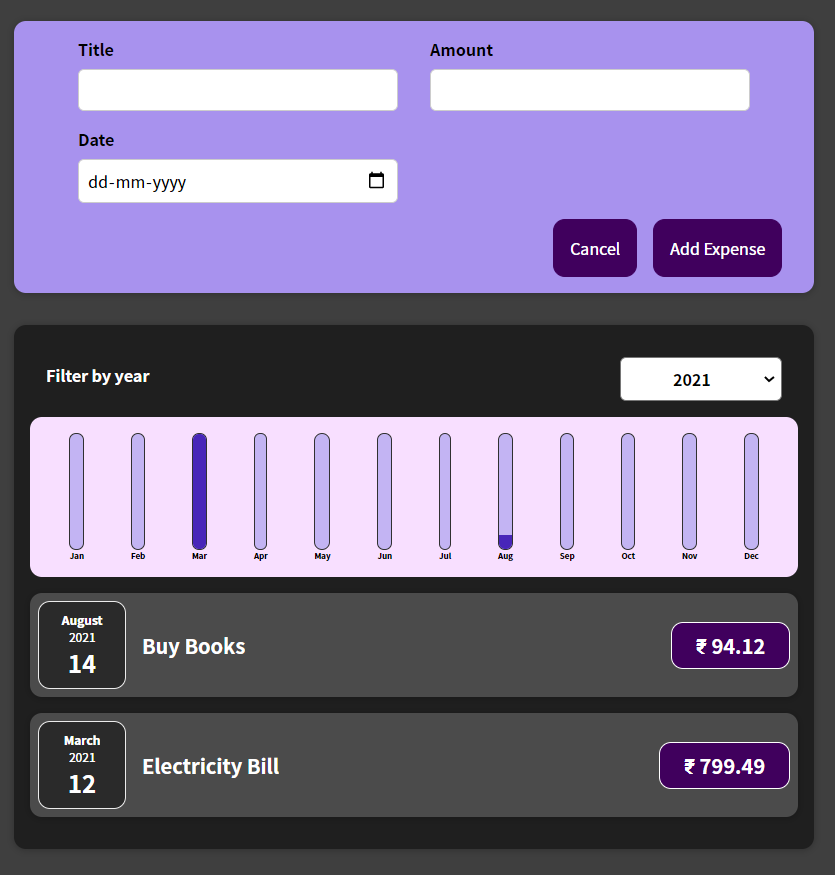

## Expense Tracker
> A project for storing user expenses and displaying Bars for each months as a views to users for better understanding 

## Actually want to use?
[Expense Tracker](https://user-expense-tracker.netlify.app/) is a React JS based project developed while learning React and used some features of React such as States and Portals

## Snapshots

